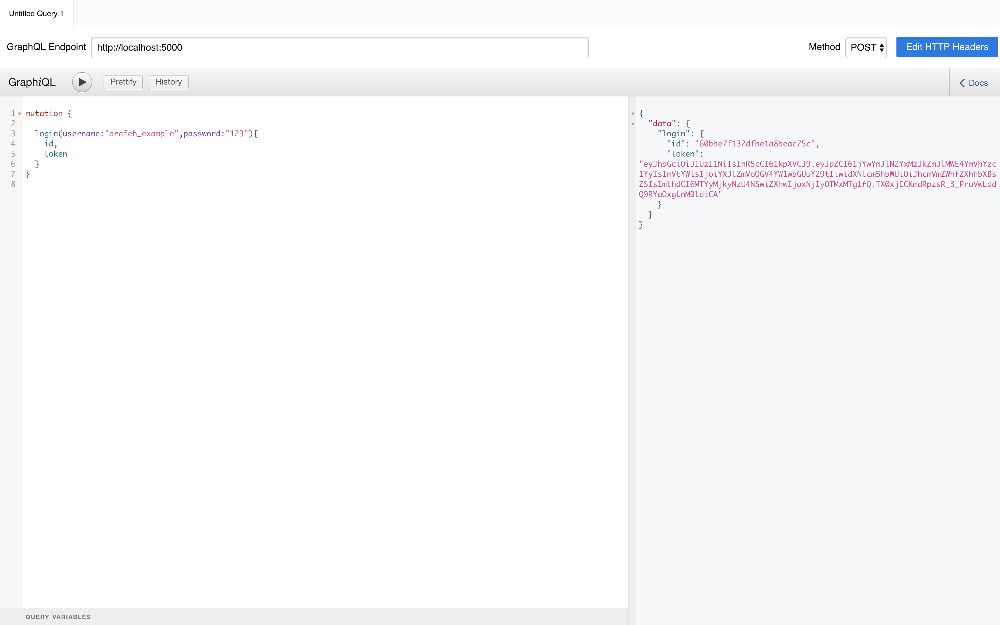
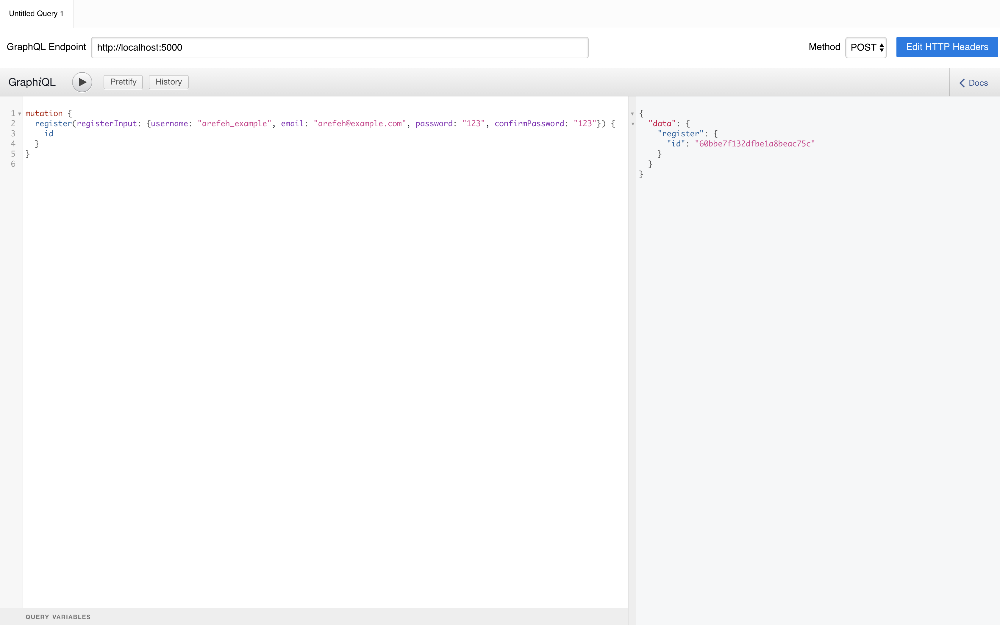

# mern-graphql-post-user-app

### Steps to install and run
1. make sure you have Mongodb, node installed
2. npm install
3. npm run start

Examples of login and registration using graphiql (https://www.electronjs.org/apps/graphiql)

